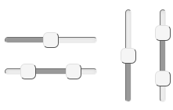
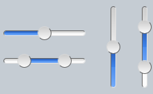

# deliteful/Slider

The `deliteful/Slider` widget allows selecting one value or a pair of values, from a range delimited by a minimum and
a maximum value. Slider can be oriented vertically or horizontally.

*Slider overview by theme (bootstrap, iOS, Holodark)*





The selected value depends on the position of the handle and the `step`, which specifies the value granularity. The 
position of the minimum and maximum depends on the text direction, and can be forced using the `flip` property.

Handles can be move using pointers (mouse, touch) or keys (up, down, home or end).

A `change` event is fired after the user select a new value, either by releasing a pointer, or by pressing a selection
key. Before a `change` event, `input` events are fired while the user moves the Slider handle.

The Slider Widget supports ARIA attributes `aria-valuemin`, `aria-valuemax`, `aria-valuenow` and `aria-orientation`.

Most of the Slider behavior (default values, out of bound values reconciliations...) is similar to the [HTML5.1 input 
type=range element](http://www.w3.org/html/wg/drafts/html/master/forms.html#range-state-%28type=range%29), but it 
doesn't strictly conform to the specification, in particular for:
- the `multiple` attribute (single/range Slider is directly determined from the content of the value property)
- the `datalist` attribute (currently implemented with `deliteful/Rule`)

Like the native input type=range element, this widget can be used in a form.

##### Table of Contents
[Element Instantiation](#instantiation)  
[Element Configuration](#configuration)  
[Element Styling](#styling)  
[Mixins](#mixins)  
[Element Events](#events)  
[Enterprise Use](#enterprise)  
[See also](#seealso)

<a name="instantiation"></a>
## Element Instantiation

See [`delite/Widget`](/delite/docs/master/Widget.html) for full details on how instantiation lifecycle is working.

### Declarative Instantiation

```html
<html>
  <d-slider></d-slider>
  <d-slider value="12,32"></d-slider>
</html>
```

<iframe width="100%" height="200" allowfullscreen="allowfullscreen" frameborder="0" 
src="http://jsfiddle.net/ibmjs/EL2Tn/embedded/result,html">
<a href="http://jsfiddle.net/ibmjs/EL2Tn/">checkout the sample on JSFiddle</a></iframe>

You can also specify the initial value in an input element:

```html
<html>
  <d-slider>
    <input value="32">
  </d-slider>
  <d-slider>
    <input value="24,32">
  </d-slider>
</html>
```
That way you allow Slider to benefit from the browser capability to track the value when user select back/forward
buttons.

### Programmatic Instantiation

```js
  require([
    "delite/register",
    "deliteful/Slider"
  ], function (register, Slider) {
    var slider = new Slider({value:10, step:5, min:10, max:50});
    slider.placeAt(document.body);
    slider.startup();  
});
```

<a name="configuration"></a>
## Element Configuration
### Using value, min, max and step properties
`min` (default=0) and `max` (default=100) allow to set the minimum and maximum boundaries of the allowed range of
values.

`step` (default=1) specifies the value granularity. It causes the slider handle to snap/jump to the closest possible
value.

`value`, `min`, `max` and `step` properties must be valid floating-point numbers. Any other value is defaulted 
according to the HTML 5.1 specification. `value` accept two values separated by a comma.

### Selecting or sliding a range of values
When `value` contains two values separated by a comma, the Slider displays two handles. `slideRange` (default=true) 
allow sliding the area between the handles to change both values at the same time.

When `slideRange=false`, pointing the area between the handles cause the closest handle to move at the pointer position
(Thus, changing only one value).

### Slider direction and orientation
Default Slider orientation is horizontal. The `vertical` property (default=false) allow setting the vertical 
orientation.

The Slider direction follows the language direction: with RTL languages the `min` is placed on the right. You may 
force the orientation using the `flip` property (default=false).

<a name="styling"></a>
## Element Styling
### Supported themes

This widget provides default styling for the following delite themes:

* bootstrap
* iOS
* Holodark

### CSS Classes
Style is defined by the CSS classes from the themes of the widget. CSS classes are bound to the
structure of the widget declared in its template `deliteful/Slider/Slider.html`

|class name|applies to|
|----------|----------|
|d-slider|the Slider widget node|
|d-slider-container|the container node, which represents the full length of slider progress bar.|
|d-slider-progress-bar|the progress bar node which represent the range between `min` and `value` or the range between
both values in the case of a range Slider|
|d-slider-handle|slider handle(s)|
|d-slider-handle-max|the handle which represent the selected value (or the larger of the two values)|
|d-slider-handle-min|the handle which represent the smaller of the two values in the case of a range Slider|

There are other classes prefixed by `d-slider`, but they aren't meant to be overridden by the application.

### Customizing the colors

<iframe width="100%" height="200" allowfullscreen="allowfullscreen" frameborder="0" 
src="http://jsfiddle.net/ibmjs/pX4Jb/embedded/result,css">
<a href="http://jsfiddle.net/ibmjs/pX4Jb/">checkout the sample on JSFiddle</a></iframe>

### Customizing the size
TODO + jsfiddle

## User Interactions
The value of the Slider can be changed by:

* Using a pointer (touch, click...)
 * moving a handle
 * moving the bar between two handles when `slideRange=true` and value contains two values separated by a comma
 * pointing anywhere else on the Slider area: moves the handle that is the closest from the pointer position
* Using the `arrow left`, `arrow right` or `arrow up`, `arrow down` and `home`, `end` keys when the widget has the focus.

<a name="mixins"></a>
## Mixins

No Mixin is currently provided for this widget.

<a name="events"></a>
## Element Events

* Emits a `change` event after that the value has been changed since that the slider has the focus, whenever the user releases 
  its pointer or a presses a key from the keyboard.
* Emits `input` events when the value changes, whenever the user moves a handler.

<a name="enterprise"></a>
## Enterprise Use
### Accessibility
The Slider supports WAI-ARIA role `slider` and ARIA attributes `aria-valuemin`, `aria-valuemax`, `aria-valuenow` and 
`aria-orientation` on handle nodes.

|type|status|comment|
|----|------|-------|
|Keyboard|ok|when handle has focus: `arrow left`, `arrow right` or `arrow up`, `arrow down` and `home`, `end` keys|
|Visual Formatting|ok|Support high contrast on Firefox and Internet Explorer desktop browsers.|

### Browser Support
This widget supports all supported browsers without any degraded behavior.

<a name="seealso"></a>
## See also
### Samples
- deliteful/samples/Slider.html
